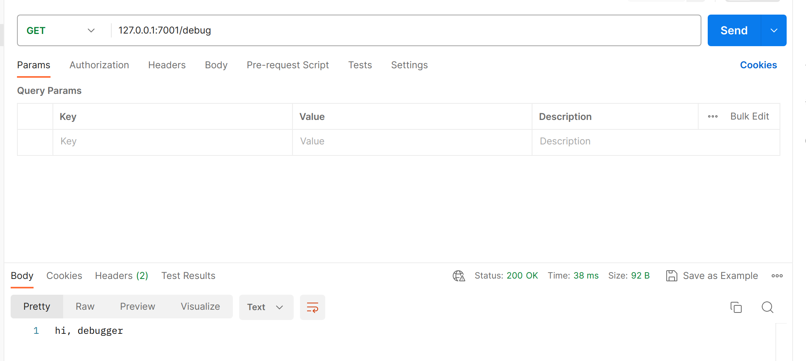
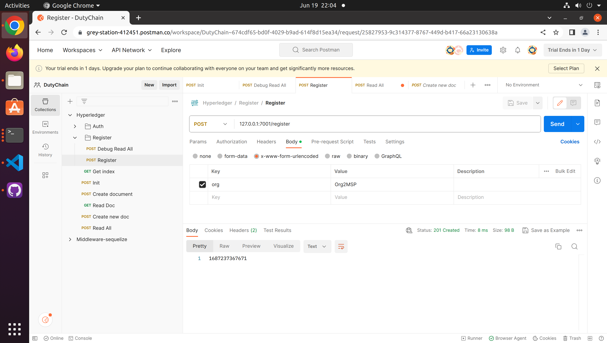
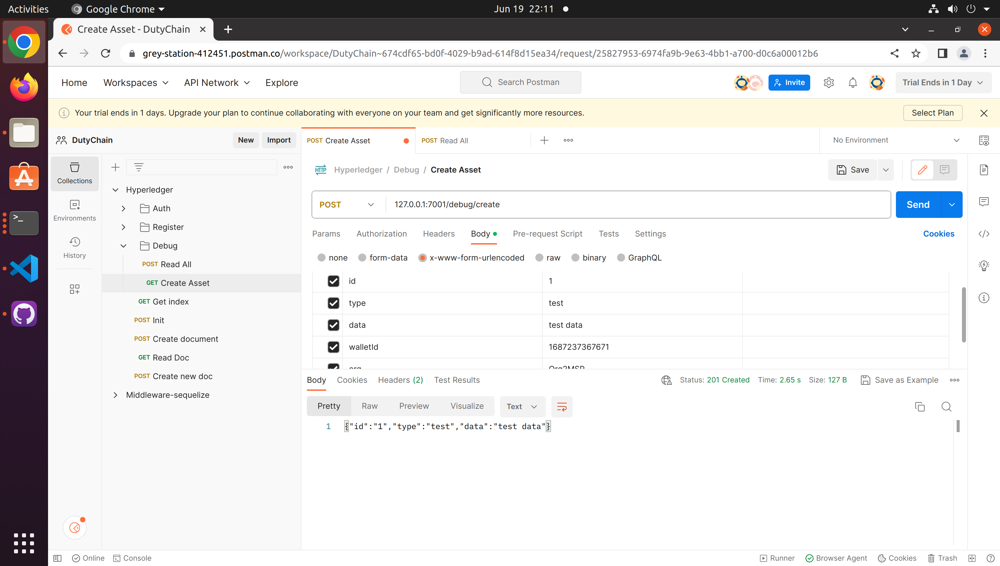

# dutychain-middleware


## QuickStart

<!-- add docs here for user -->

see [egg docs][egg] for more detail.

### Development

```bash
$ npm i
$ npm run dev
$ open http://localhost:7001/
```

### Deploy Middleware

```bash
$ npm start
$ npm stop
```

### Start Hyperledger Network
* network logs are located at ~/logs
```bash
$ cd hyperledger/test-network
$ ./network.sh up createChannel -c mychannel -s couchdb -ca
$ ./network.sh deployCC -ccn ledger -ccp ../chaincode/ledger-doctype/ -ccl javascript -ccep "OR('Org1MSP.peer','Org2MSP.peer')"
```

### CleanUps
```bash
# clean up logs
$ cd ~/logs
$ rm -rf *

# clean up hyperledger network
$ cd hyperledger/test-network
$ ./network.sh down

# clean up wallets
$ cd app/blockchain
$ rm -rf wallet

# drop database schema
$ mongosh
$ use db_egg
$ db.dropDatabase()
```


## APIs

### init
initialize the ledger, before using blockchain, must call this first before calling any other API

<B>No parameters are required</B>

Example:
```bash
$ curl --header "Content-Type: application/json" --request POST localhost:7001/debug/init
```


### debugReadAll 
<B>read all in using admin identity</B>
<B> for debug usage only, don't call this</B>
Get all assets in the network, no identity(wallet) is required.

<B>No paramters are required</B>

Example:
```bash
curl --header "Content-Type: application/json" --request POST localhost:7001/debug/debugReadAll
```


### Register
create an indentity, require to input <B>{org}</B>, return walletID 

```bash
curl --header "Content-Type: application/json" --request POST localhost:7001/register/
```



### Create
create an asset in hyperledger, input <B>{id, type, data, walletId, org}</B> in JSON format, return the result that added in blockchain.




### Read
create an asset in hyperledger, input <B>{id, walletId, org}</B> in JSON format, return the result that added in blockchain.

<
### npm scripts

- Use `npm run lint` to check code style.
- Use `npm test` to run unit test.
- Use `npm run autod` to auto detect dependencies upgrade, see [autod](https://www.npmjs.com/package/autod) for more detail.


[egg]: https://eggjs.org